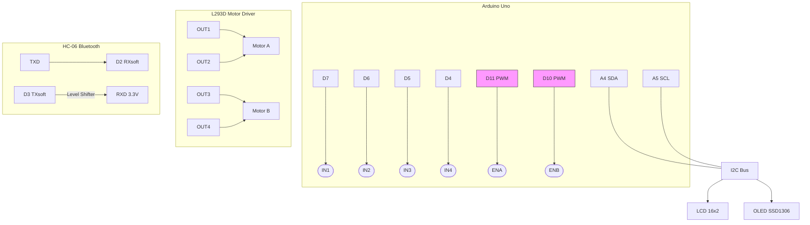

```mermaid

flowchart TD
  subgraph Controller [Arduino Uno]
    D7[D7] --> IN1
    D6[D6] --> IN2
    D5[D5] --> IN3
    D4[D4] --> IN4
    D11[D11 PWM] --> ENA
    D10[D10 PWM] --> ENB
    SDA[A4 SDA]
    SCL[A5 SCL]
  end

  subgraph Driver [L293D Motor Driver]
    IN1([IN1])
    IN2([IN2])
    IN3([IN3])
    IN4([IN4])
    ENA([ENA])
    ENB([ENB])
    OUT1[OUT1] --> MA[Motor A]
    OUT2[OUT2] --> MA
    OUT3[OUT3] --> MB[Motor B]
    OUT4[OUT4] --> MB
  end

  subgraph Communication [HC-06 Bluetooth]
    TXD[TXD] --> D2[D2 RXsoft]
    D3[D3 TXsoft] -- "Level Shifter" --> RXD[RXD 3.3V]
  end

  SDA & SCL --- I2C_Bus[I2C Bus]
  I2C_Bus --> LCD[LCD 16x2]
  I2C_Bus --> OLED[OLED SSD1306]

  style D11 fill:#f9f,stroke:#333
  style D10 fill:#f9f,stroke:#333

```
