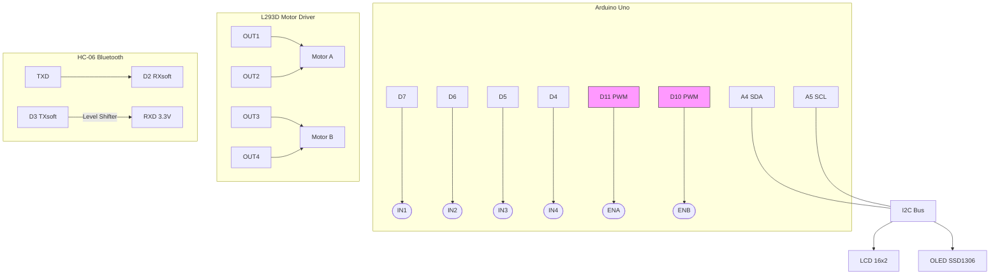

# Bluetooth Controlled Car — Arduino Uno

A two-wheel drive RC car built on an **Arduino Uno** and an **L293D** motor driver, controlled over Bluetooth with an **HC-06** module. A 16x2 LCD and an SSD1306 OLED on the front of the car communicate with the Arduino over I2C, and an **LM2596** buck converter regulates the power supply.

> Project details and photos: [emirhanyildiz.com — Embedded Prototype](https://www.emirhanyildiz.com/en/projects/embedded-proto)

## Hardware

| Component | Purpose |
|---|---|
| Arduino Uno | Main controller |
| L293D | Dual H-bridge motor driver |
| 2x DC gear motor + caster wheel | Drive (front) + support (rear) |
| HC-06 | Bluetooth serial link (9600 baud) |
| LCD 16x2 (I2C, `0x27`) | Front display |
| OLED SSD1306 128x64 (I2C, `0x3C`) | Front display |
| LM2596 | Step-down power regulation |

## Pin Mapping

| Arduino | Connected to |
|---|---|
| D7, D6 | L293D IN1, IN2 (left motor) |
| D5, D4 | L293D IN3, IN4 (right motor) |
| D11, D10 (PWM) | L293D ENA, ENB (speed) |
| D2 (RX), D3 (TX) | HC-06 TXD / RXD (via level shifter, SoftwareSerial) |
| A4 (SDA), A5 (SCL) | I2C bus → LCD + OLED |

## Bluetooth Commands

Single-character commands sent from any Bluetooth serial controller app:

| Command | Action |
|---|---|
| `F` / `B` | Forward / backward |
| `L` / `R` | Turn left / right |
| `S` | Stop |
| `0`–`4` | Speed: 0, 100, 150, 200, 255 (PWM) |

## Circuit Schematic

## Build & Upload

1. Open `bluetooth-car.ino` in the Arduino IDE.
2. Install the required libraries: `LiquidCrystal_I2C`, `Adafruit SSD1306`, `Adafruit GFX` (SoftwareSerial, SPI and Wire ship with the IDE).
3. Select **Arduino Uno** as the board and upload.
4. Pair with the HC-06 module (default PIN is usually `1234`) and send commands from a Bluetooth serial controller app.
